# App-Name: Cropserve
Der Zweck dieser App ist es, dass Versicherungsnehmer einer Versicherung, Schäden an ihren Versicherungsobjekten  melden können. Dabei soll das Versicherungsobjekt graphisch in einer Karte dargestellt werden, sowie der Schaden selber auch.
Versicherungsnehmer können ihre Felder anlegen und speichern, um sie zu verwalten; jedoch werden diese bei der Schadensmeldung nicht berücksichtigt.

Angestellte der Versicherung (Gutachter) können ebenfalls Felder registrieren und Schäden melden und sie einem Versicherungsnehmer zuordnen. Nachdem der Schaden gemeldet wurde, kann er durch die Versicherung bearbeitet werden.
Wie man in dem Screenshot sehen kann, ist ein versichertes Feld in einem Blau-Ton eingezeichnet und ein Schadensfall in einem Rot-Ton.

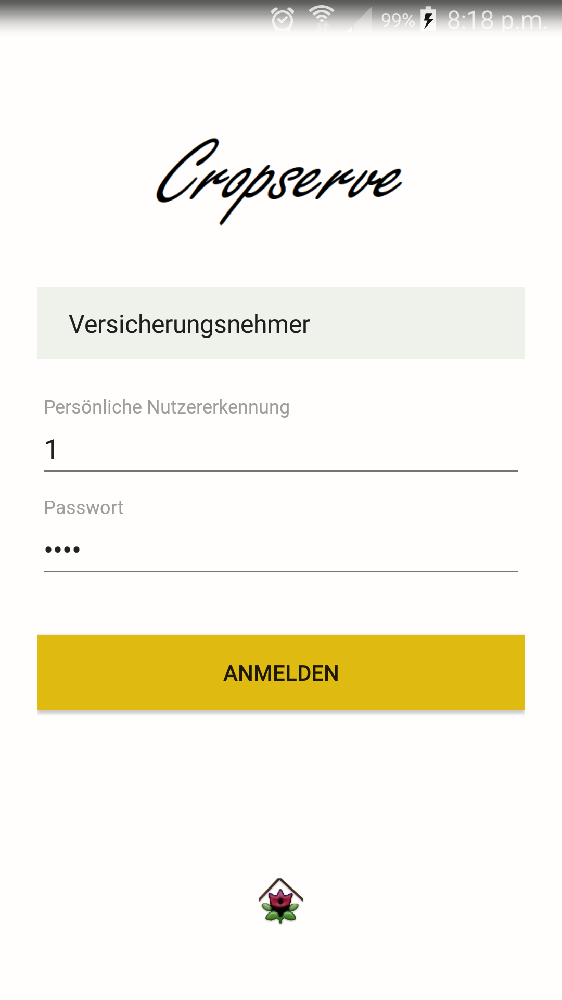

###### Screenshot des Login Screens.

Es können zwei verschiedene Arten von Benutzern einloggen.
Ein Gutachter (vorgegeben mit der ID 1 und Passwort 1234) und 2 Versicherungsnehmer (jeweils mit den IDs 1 und 2 und dem gleichen Passwort 1234) sind als Dummy-Daten enthalten.

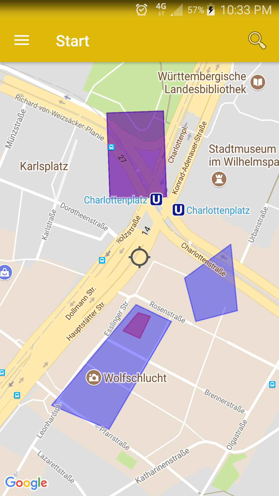

###### Screenshot des Startbildschirms nach dem Login

# Features

## Critical Features
### 1. Verwalten der Felder:

###### Im Menüpunkt Felder kann man seine Felder verwalten. Man kann sie dort bearbeiten, löschen oder neu erstellen. Auch sind dort detaillierte Feld-Information einsehbar.

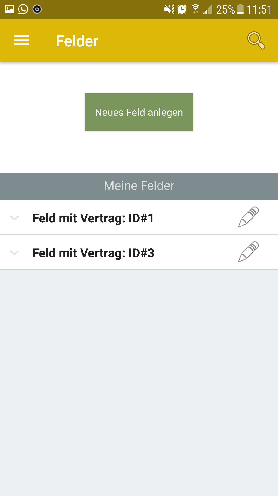

###### In der Felderansicht werden alle Felder des derzeitig eingeloggten Benutzers angezeigt.

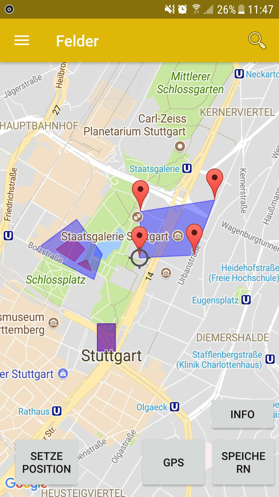

###### Mit "Setze Position" oder durch Berühren der Karte, kann man die Eckpunkte des Feldes setzen. Das Feld wird während dem Setzen der Eckpunkte gezeichnet. Durch "drag and drop" kann die Position eines Eckpunktes angepasst werden. Durch kurzes Anklicken eines Eckpunktes kann dieser entfernt werden.

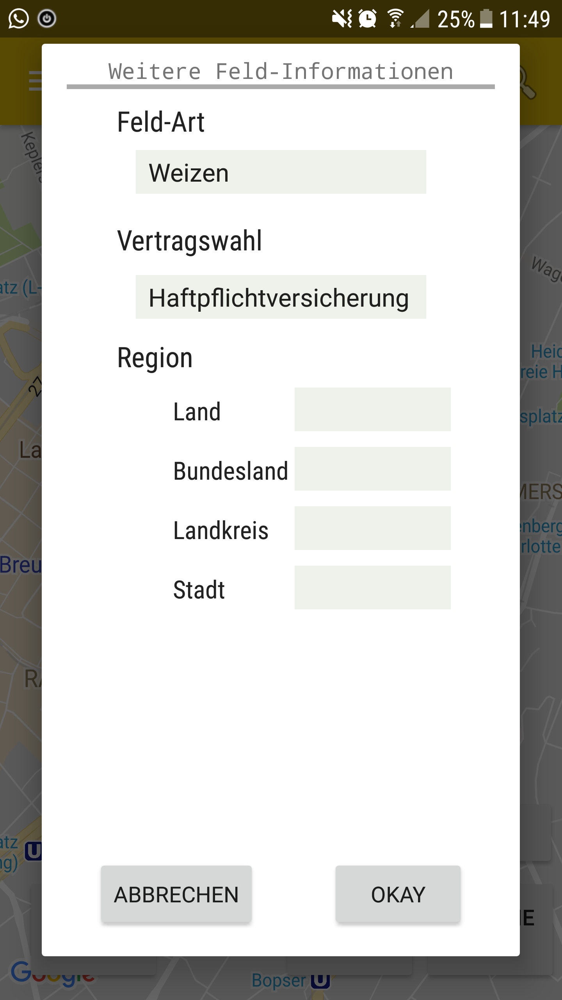

###### Über Info ruft man einen Dialog auf, in dem man zusätzliche Infos wie Standort und Feldart zum Feld hinzufügen kann

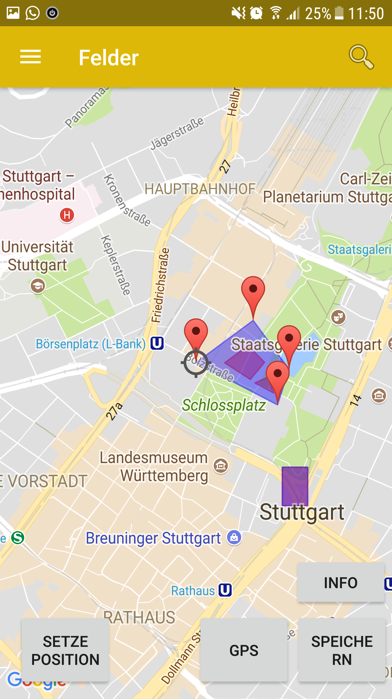

###### Über das Stift-Symbol in der Liste der Felder kann man sein Feld bearbeiten. Es wird diese Kartenansicht geöffnet, in der die Eckpunkte des Feldes schon eingezeichnet sind. Diese kann man dann verändern. Über Info kann man wie vorher zusätzliche Informationen aufnehmen und sie damit ändern.

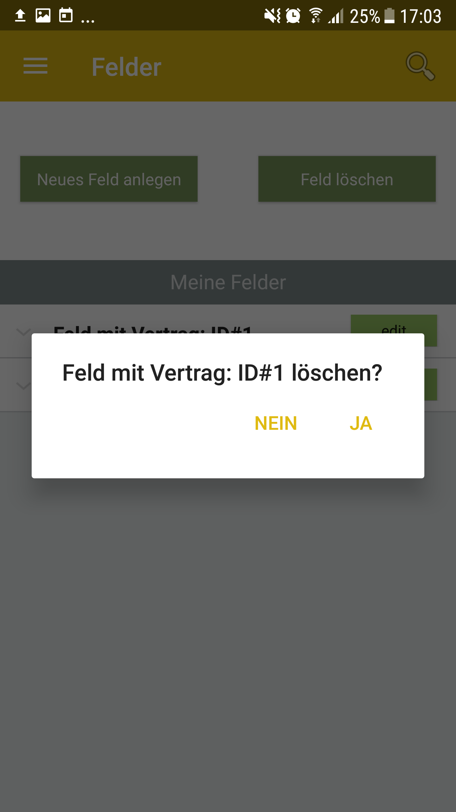

###### Durch einen "long click" auf ein Feld in der Liste kann man das Feld auswählen und löschen, nachdem man den Dialog bestätigt hat.

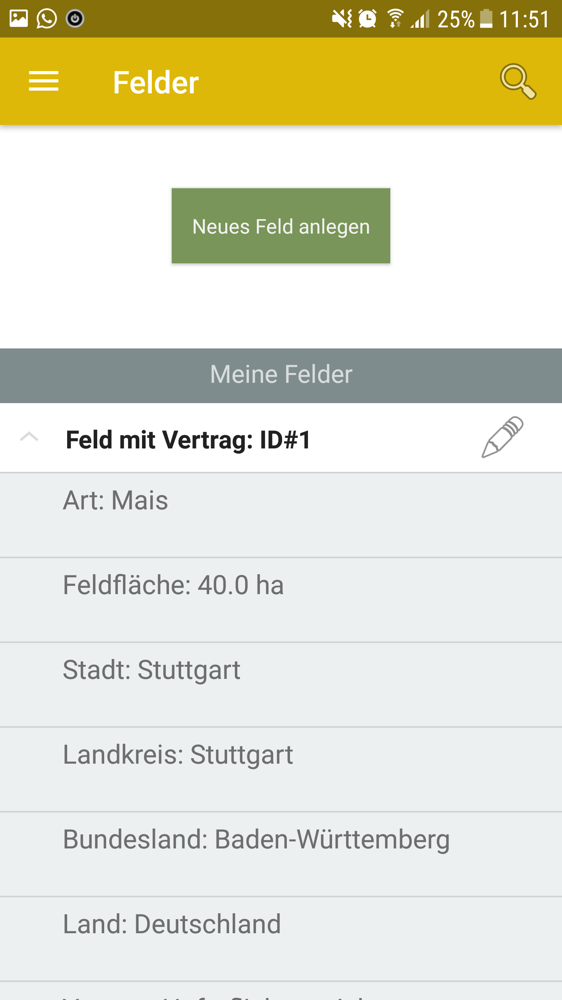

###### Durch einfaches Klicken auf ein Feld in der Felderansicht, können dessen zusätzliche Informationen aufgeklappt werden.

### 2. Verwaltung der Schäden:
###### Im Menüpunkt Schadensmeldungen kann man Schäden anschauen, melden, löschen und bearbeiten.
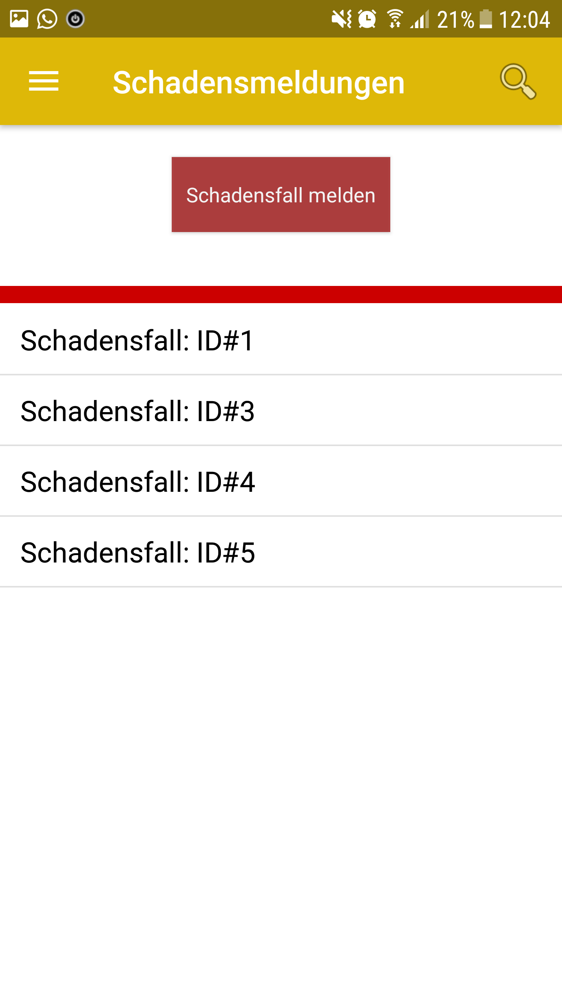

###### Im Menü-Unterpunkt Schadensmeldungen werden alle vom Benutzers gemeldeten Schadensfälle in einer Liste angezeigt.

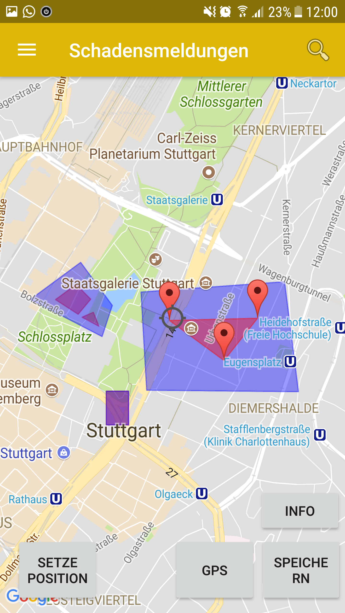

###### Über "Schadensfall melden" kann man seinen Schaden melden, in dem man Eckpositionen des Schadens auf einer Karte in einem Feld setzt; durch das Klicken auf den Button "Setze Position" oder berühren der Karte setzen sich die Marker. Durch "drag and drop" kann man die Eckpunkte des Schades anpassen. Durch kurzes Anklicken eines Eckpunktes kann dieser wieder gelöscht werden.

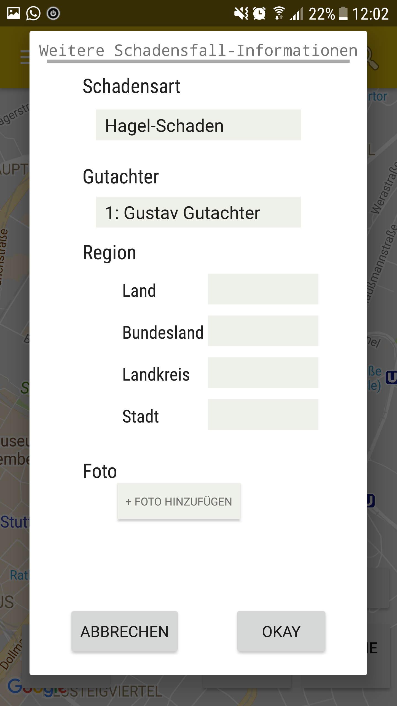

###### Über "Info" kann man zusätzliche Informationen zum Schaden melden und ein Foto zum Schadensfalls hinzufügen.

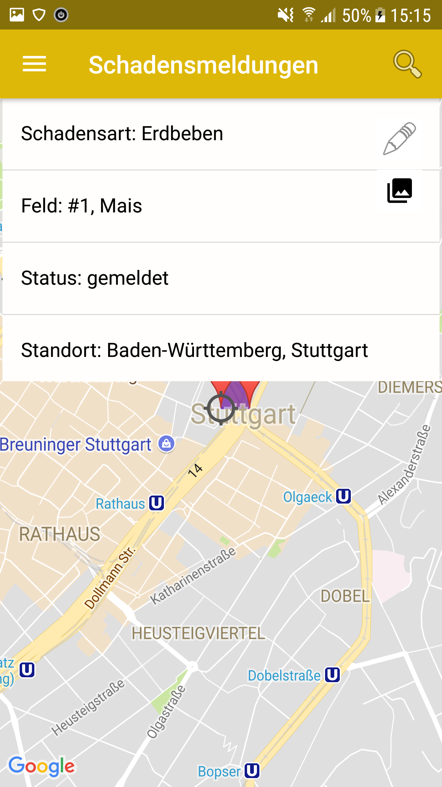

###### Wenn man in der Ansicht für Schadensmeldungen auf einen Schaden in der Liste klickt, öffnet sich diese Ansicht wo ihn bearbeiten kann oder sich nur die Zusatzinformationen und ein zum Schadensfall gehörendes Foto anschaut.

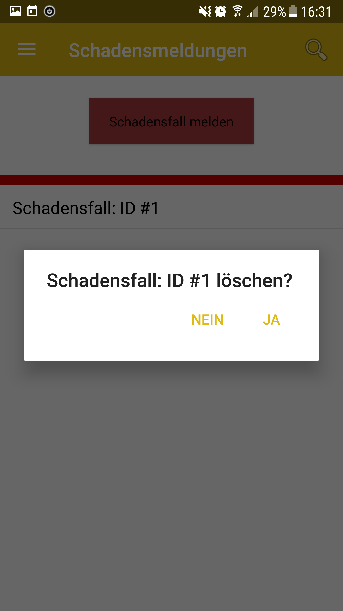

###### Durch einen "long click" kann man einen Schadensfall auswählen und löschen, nachdem man den Dialog bestätigt hat.

## Additional Features
### 1. Navigieren mit einem Menü:
Über Klicken auf das "Hamburger-Icon" oder swipen vom linken Bildschirmrand nach rechts, öffnet sich ein Menü in dem man über einzelne Menüpunkte navigieren kann. Im Kopf des Menüs werden die ID und der Name des Benutzers angezeigt.

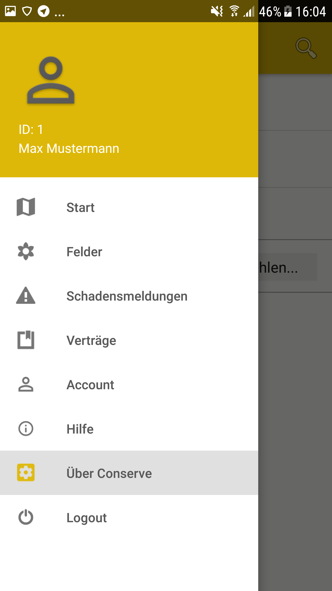

###### Das geöffnete Menü.

### 2. Suchen:
###### Über das Such-Icon (Lupe) kann man die App nach Schadensfällen, Benutzern, Gutachtern, Feldern und Verträgen durchsuchen.

###### Durch Klicken auf die Lupe öffnet sich die Suchleiste.

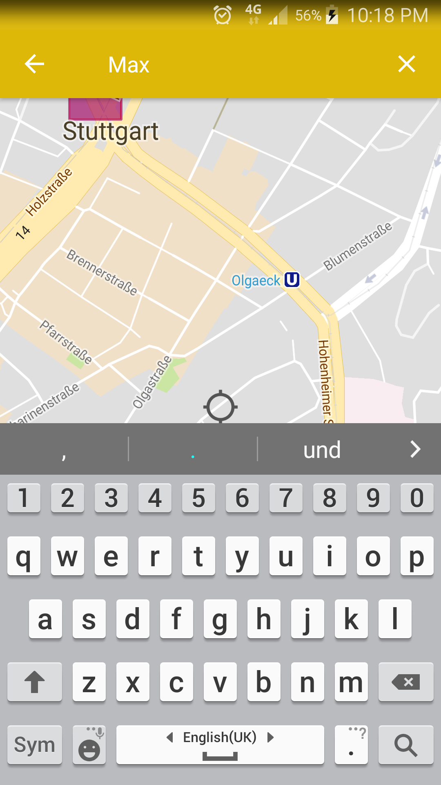

###### Man kann nach seinem gewünschten Begriff suchen.

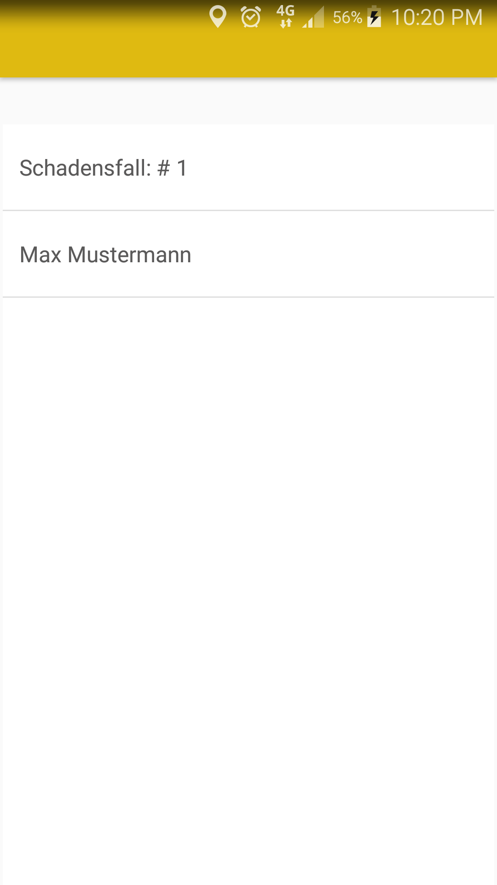

###### Die Ergebnisse werden in einer Listen-Ansicht aufgelistet.

### 3. Graphische Darstellung:
###### Über eine Kartenansicht werden Felder und Schadensfälle als farbliche Polygone dargestellt.

### 4. Verwaltung der Verträge

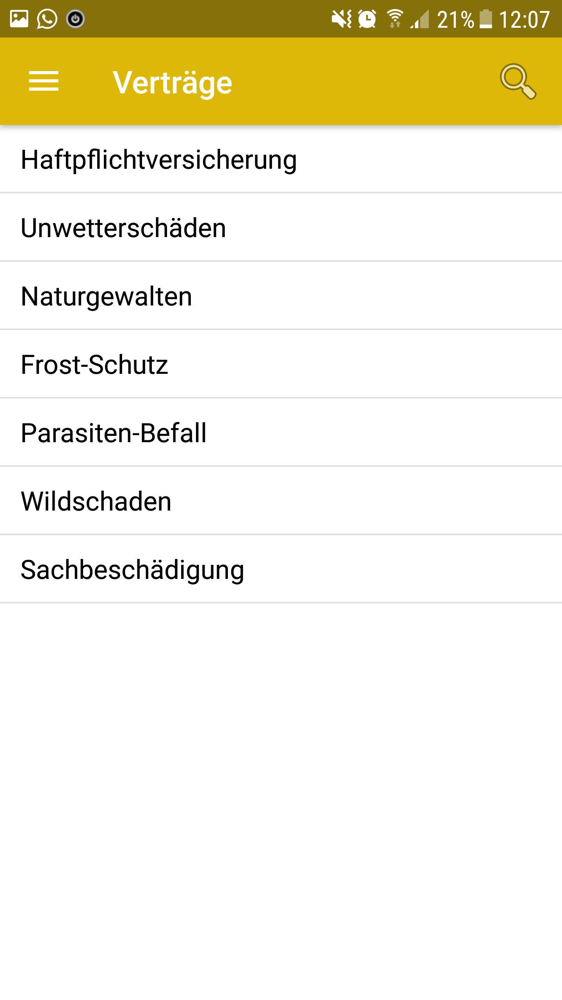

###### Im Verträge-Unterpunkt des Menüs werden alle Verträge angezeigt, die vorhanden sind. Durch Klicken auf einen Vertrag werden dessen Informationen angezeigt und welche Felder von dem eingeloggten Benutzer zu diesem Vertrag zugewiesen worden.

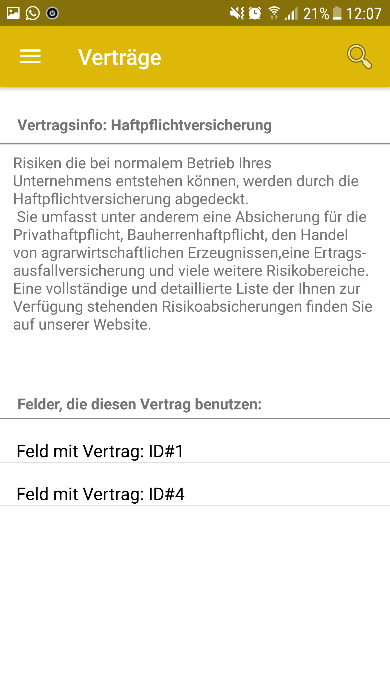

###### Die genauen Informationen zu einem Vertrag und welche Felder ihm zugewiesen sind, werden in dieser Ansicht dargestellt.

### 5. Verwaltung der eigenen Benutzerdaten

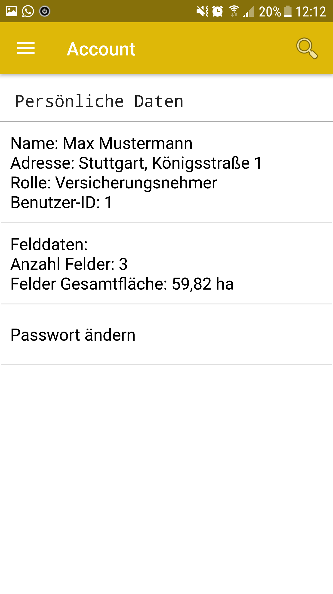

###### Im Account-Unterpunkt des Menüs werden alle wichtigen Informationen des derzeit eingeloggten Benutzers dargestellt.

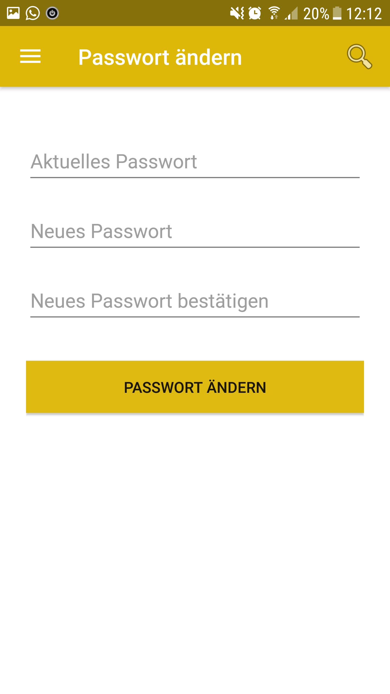

###### Durch Klicken auf "Passwort ändern" öffnet sich eine Ansicht, in der man sein Passwort ändern kann.

### 6. Anzeigen, Erstellen und Löschen von Benutzern
###### Im Account Unterpunkt des Menüs findet man, wenn man als offizieller Gutachter angemeldet ist, eine Option zur Erstellung und Löschung von Benutzern. Außerdem befindet sich dort auch eine Option zu einer Liste aller Versicherungsnehmer zu gehen und sich deren Basis-Informationen anzuschauen.

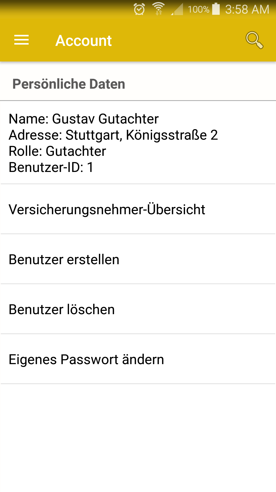

###### Die Account-Ansicht eines Gutachter. Es sind die zusätzlichen Optionen "Benutzer erstellen", "Benutzer löschen" und "Versicherungsnehmer-Überischt" zu finden.

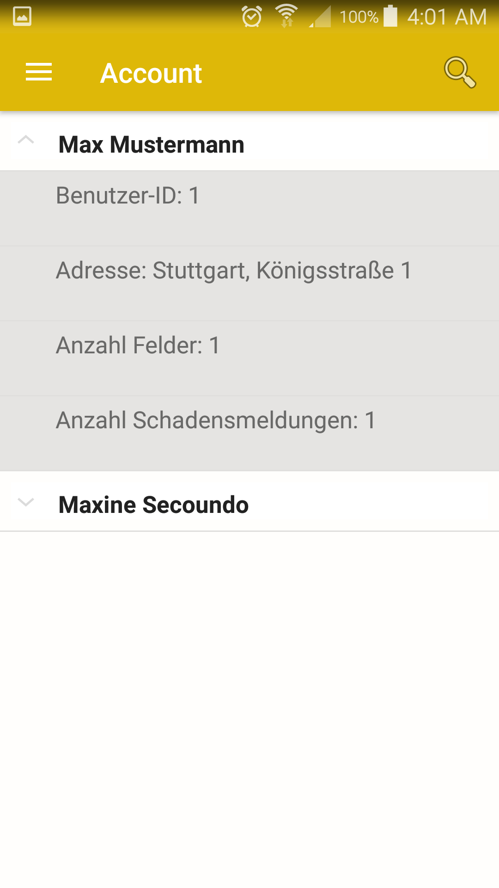

###### Die Liste enthält alle registrierten Versicherungsnehmer und grundlegende Informationen über diese, die man über einen Klick auf einen Namen aufklappen kann.

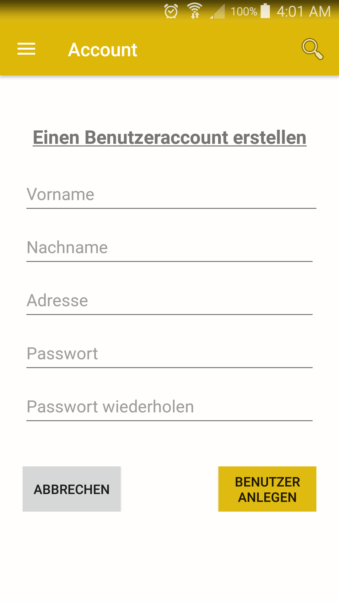

###### Um einen Versicherungsnehmer zu erstellen muss man unter "Benutzer erstellen" das angezeigt Formular ausfüllen. Über den Button "Benutzer anlegen" wird der Vorgang abgeschlossen. Um die automatisch zugewiesene User-ID zu erfahren, kann man unter der Liste aller Versicherungsnehmer nachschauen.

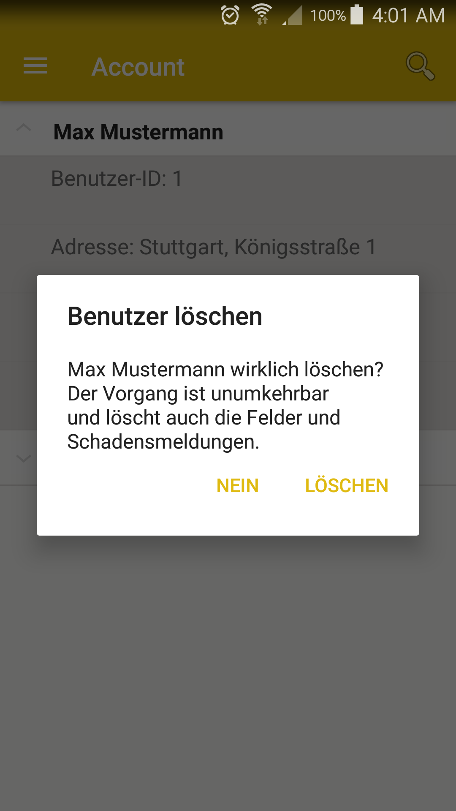

###### Um einen bestehenden Versicherungsnehmer zu löschen, klickt man entweder auf "Benutzer löschen" in der Account-Ansicht oder geht direkt auf die Liste über "Versicherungsnehmer-Übersicht". Mit einem "long click" auf einen Namen öffnet sich ein Dialog, in dem man die Löschung nach eingehender Warnung zweimal bestätigen muss. Hier ist diese zweite Warnung zu sehen. Nach dem Löschen sollte die Ansicht einmal verlassen und wieder geöffnet werden, um sie zu aktualisieren. Danach sind alle Spuren des gelöschten Benutzers entfernt.

### 7. Hilfe

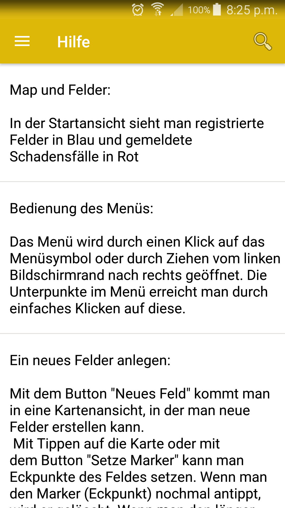

###### Im Hilfe-Unterpunkt des Menüs sind Hilfestellungen gegeben, wie man die App korrekt benutzt.

### 8. Sprachauswahl

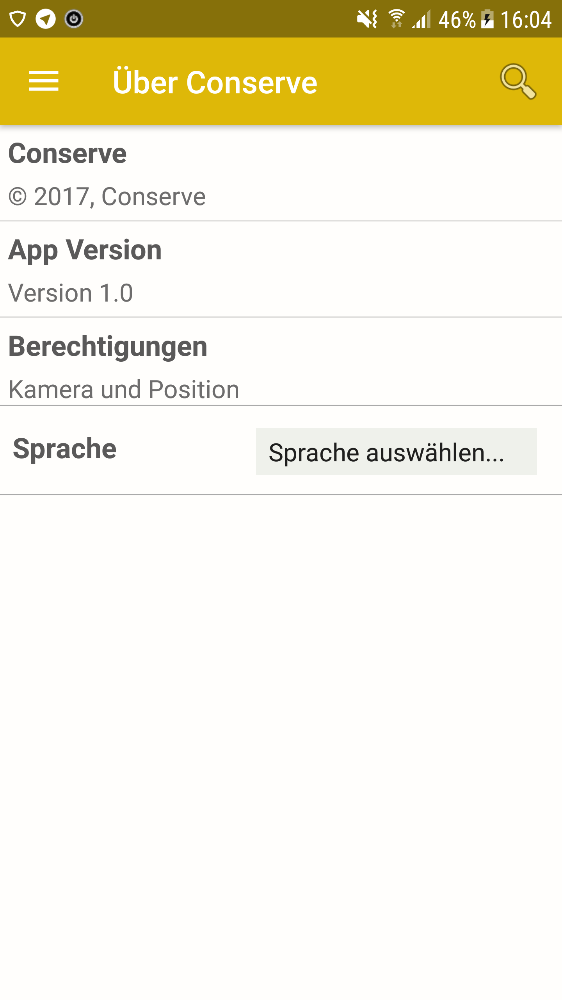

###### Im Über Cropserve Unterpunkt des Menüs kann man die App Informationen einsehen, sowie die Sprache für die App auswählen. Es werden Deutsch und Englisch angeboten.

# Installation

1. APK-Datei "app-cropserve.apk" aus dem GitLab-Wurzelverzeichnis herunterladen.
2. Die APK in einen beliebigen Ordner auf dem Handy ziehen.
3. Auf dem Handy zu diesem Ordner navigieren und die APK mit einem (Doppel-)Klick installieren.
4. Nach der Installation wird beim erstmaligen Öffnen der App eine Internet Verbindung benötigt, da der Google Maps API Key abgeglichen werden muss; ansonsten funktioniert die graphische Darstellung (Karte, Polygone) nicht. Danach ist die App jedoch offline benutzbar.

# Initiale Verwendung
Man kann sich nach dem Starten der App entweder als Gutachter oder als Versicherungsnehmer einloggen.
Es sind dabei Daten für 3 Personen vorgegeben, einen Gutachter und 2 Versicherungsnehmer.
 - Person 1 ist ein Versicherungsnehmer mit ID 1 und Passwort 1234, Max Mustermann.
 - Person 2 ist ein Versicherungsnehmer mit ID 2 und Passwort 1234, Maxine Secoundo.
 - Person 3 ist ein Gutachter mit ID 1 und Passwort 1234, Gustav Gutachter.

Da es sich um den allerersten Start der App handelt, sollte man nach dem Einloggen der App die Berechtigung geben, auf den Standort zuzugreifen, indem man über das geöffnete Dialogfenster zustimmt.
Diese Berechtigung muss erteilt werden, um die grundlegende Funktion der App benutzen zu können (GPS, Map Services).

# Verwendung der App

## Wichtiger Anwendungsfall 1
*Felder erstellen:*

Unter dem  Menüpunkt Felder kann man noch nicht registrierte Felder erstellen und bereits existierende Felder anschauen, bearbeiten oder löschen.

## Wichtiger Anwendungsfall 2
*Schadensfall melden:*

Unter dem Menüpunkt Schadensfälle kann man Schäden an registrierten Versicherungsobjekte (Feldern) melden, anschauen, bearbeiten oder löschen.

# Changelog

Die Entwicklungsgeschichte befindet sich in [CHANGELOG.md](CHANGELOG.md).

# Verwendetete Bibliotheken
Verwendete Bibliothek | Version
--- |:---:
[Google Maps Android API] (https://developers.google.com/maps/documentation/android-api/) | 11.0.4
[JUnit Test Framework] (http://junit.org/junit4/) | 4.12
[Mockito Test] (https://github.com/mockito/mockito) | 2.6.1
[Espresso Test Runner] (https://developer.android.com/topic/libraries/testing-support-library/release-notes.html) | 3.0.1
[Android Support Library] (https://developer.android.com/topic/libraries/support-library/index.html) |

# Lizenz

MIT-License [LICENSE](https://sopra.informatik.uni-stuttgart.de/sopra-ws1718/sopra-team-33/blob/master/LICENSE)