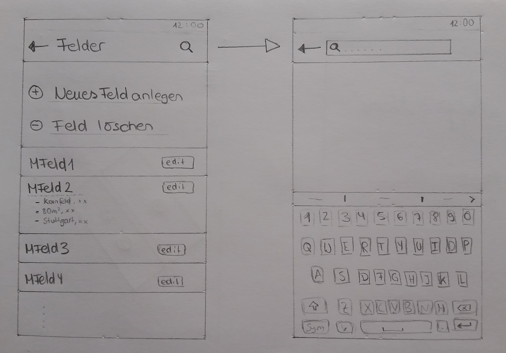

# Einführung

Mit der App soll man Schadensfälle an Felder, die zu einem Vertrag gehören, übermittelt werden. Zur Speicherung dieser Daten wird eine Datenbank verwendet und zur Ansicht eine Kartenansicht.

Es wird das Model-View-Controller Entwurfsmuster verwendet. Das Model wird durch eine Datenbank und deren Daten-Hilfsklassen repräsentiert. Eine Kartenansicht auf der die Daten eingezeichnet werden und ein Menü bilden das View. Über das Menü kann man Verträge, Felder und Schadensfälle aufrufen, sowie neu erstellen oder bearbeiten.
Der Controller wird realisiert über Fragment-Klassen, welche den User-Input einer bestimmten (Verwaltungs-)Ansicht erkennen, verarbeiten und anwenden. Diese Fragment-Klassen bilden so etwas wie eine Ergänzung zu den entsprechenden rein "informativen" Klassen (wie zB. Feld oder Person), die die Daten definieren und deren Abruf bereitstellen. Beide fallen unter die Komponente Verwaltung.

# Komponentendiagramm

![Gubaer at the German language Wikipedia [GFDL (http://www.gnu.org/copyleft/fdl.html) or CC-BY-SA-3.0 (http://creativecommons.org/licenses/by-sa/3.0/)], via Wikimedia Commons](images/Komponentendiagramm.png)

## Komponente 1 - Verwaltung

Die Verwaltung stellt die Daten wie Verträge, Felder und Schadensfälle bereit. Sie bekommt die Daten aus dem persistenten Speicher der Datenbank Komponente.

## Komponente 2 - Visuelle Darstellung

Die Visuelle Darstellung bekommt die darzustellenden Daten von der Verwaltungskomponente. Sie erstellt die Kartenansicht und das Menü und gibt die Daten diesen Komponenten weiter.

## Komponente 3 - Datenbank

Die Datenbank speichert alle Daten bezüglich der App persistent und stellt sie der Verwaltung bereit.

## Komponente 4 - Kartenansicht

Die Kartenansicht wird von der Visuellen Darstellung erzeugt und stellt die Verträge, Felder und Schadensfelder in einer Karte dar. Sie bekommt von der Google API Werkzeuge bereitgestellt, die diese Darstellung erleichtern.

## Komponente 5 - Menü

Das Menü wird von der Visuellen Darstellung erzeugt. Mit dem Menü kann man Verträge, Felder und Schadensfelder auswählen und sich über die Kartenansicht darstellen lassen. Des Weiteren kann man mit dem Menü neue Schadensfälle, Felder und Verträge registrieren und bearbeiten.

## Externe Komponente 1 - Google Maps API

Die Google API ist eine externe Bibliothek, die der Kartenansicht Werkzeuge zum Erstellen von Polygonen oder Standpunkten bereitstellt.

# Klassendiagramm

![Gubaer at the German language Wikipedia [GFDL (http://www.gnu.org/copyleft/fdl.html) or CC-BY-SA-3.0 (http://creativecommons.org/licenses/by-sa/3.0/)], via Wikimedia Commons](images/classdgm2.jpg)

## Beschreibung der Klassenhierarchie

Die DatenbankDaten Klasse benutzt die Klassen Schadensfall, Feld, Vertrag und Person um Daten zu speichern und auszulesen. Über die Anzeige der Klasse Menü können Verträge, Felder, Schadensfälle ausgewählt und bearbeitet werden. Durch die Klasse Maps können Verträge, Schadensfälle und Felder auf einer Karte angezeigt werden.

## Beschreibung der Klasse Schadensfall

Ein Schadensfall kann von einer Person gemeldet werden und einem Feld zugeordnet werden. Ein Schadensfall-Objekt umfasst alle relevanten Daten (darunter die von der Klasse Region bereitgestellten Regions-Objekte) über einen Schaden, die zur genauen Dokumentation eines Falles notwendig sind.

## Beschreibung der Klasse Person, Benutzer und Gutachter

Die beiden Klassen Gutachter und Benutzer sind zwei verschiedene Ausprägungen der Eltern-Klasse Person, in welcher die Atrtibute für relevante Angaben zum User der App vordefiniert sind. Benutzer und Gutachter können jeweils neue Felder und Schadensfälle erfassen.

## Beschreibung der Klasse Feld

Ein Feld wird von eineer Person mit allen relevanten Daten angelegt. Einem Feld können ein oder mehrere Verträge und mehrere Schadensfälle zugeordnet werden.

## Beschreibung der Klasse Vertrag

Ein Vertrag ist über einer ihm zugewiesenen ID identifizierbar und kann einem Schadenfall über ein existierendes Feld zugewiesen werden. Die über die Datenbank definierten Verträge sind für einen Benutzer bei einer Schadensmeldung zur Auswahl und Zuordnung bereitgestellt.

## Beschreibung der Klasse Region

Eine Region definiert die genauere Lage eines Feldes und enes Schadenfalles; eine Region existiert sobald sie einmal angelegt wurde und wird von angelegten Felder und gemeldeten Schäden benutzt.

## Beschreibung der Klasse DatenbankDaten

Die Klasse DatenbankDaten bildet die Schnittstelle zu der Datenbank, über welche Daten persistent gespeichert werden können; ebenso kann über diese Klasse auf die bereits abgespeicherten Daten zugegriffen werden. Die Klasse DatenbankDaten ruft erstellt ihre Datenobjekte über den Aufruf der jeweiligen Klasse (des Pakets Datenobjekte). Außerdem stellt sie Methoden zur Verfügung Daten hinzuzufügen, zu aktualisieren und zu löschen.

## Beschreibung der Klasse Login

Die Klasse Login definiert die Methoden, um einem User der App den Login in die App zu ermöglichen. Die dafür benötigten Daten werden mit den entsprechenden Dtaen aus der Datenbank abgeglichen und daraufhin situationsgemäße Vorgänge durchgeführt. Die innere Klasse *UserLoginTask* sorgt für die Überprüfung der eingegebenen Daten und vergleicht sie auf Richtigkeit.

## Beschreibung der Klassen Account und UserCreation

Die Klasse Account dient dazu, alle wichtigen User-Daten zusammenzufassen und zu präsentieren. Außerdem enthält sie die Methoden, die es über die Weiterleitung nach *UserCreation* erlauben, Benutzer in der Datenbank anzulegen oder diese daraus zu entfernen.

## Beschreibung der Klasse Map

Die von der Google Maps API bereitgestellte Karte wird in verschiedenen Ansichten aufgerufen und als visuellen Hinweis auch die Polygone generieren, die für ein angelegtes Feld und einen gemeldeten Schaden stehen. Außerdem besteht über die Map ein Zugriff auf die Informationen der jeweilig angeklickten Polygone.

## Beschreibung der Klasse Menü

Das Menü dient hauptsächlich der Navigation durch die App und stellt dementsprechend Unterpunkte bereit, die zu veschiedenen Ansichten innerhalb der App weiterleiten. Die anzuzeigenden Daten werden aus der Datenbank geholt.

# GUI-Skizzen

## Anmeldebildschirm

Beschreibung: Beim ersten Starten der App erscheint ein Login-Screen, bei dem der Nutzer zur Eingabe seiner ID (Benutzername) und seines persönlichen Passwortes aufgefordert wird.

## Startbildschirm

Beschreibung: Wenn sich der Nutzer erfolgreich angemeldet hat, erscheint der Hauptbildschirm, wo der zuletzt angezeigte Kartenausschnitt, oder die aktuelle Position, auf einer Karte angezeigt wird. Die Karte in dieser Ansicht bietet somit direkt den Zugriff auf Informationen über Felder oder die Meldung eines Schadens. Der Nutzer kann über einen Button oben links auf die Menüleiste zugreifen. Oben rechts ist der derzeitige Nutzer der App mit Namen angegeben.

## Menüleiste

Beschreibung: Über den Aufruf der Menüleiste hat der Nutzer Zugriff auf alle Funktionalitäten der App, wie zum Beispiel die Verwaltung seiner Felder und Verträge; aber auch Einstellungen für seinen persönlichen Account sind über die Leiste einfach zu erreichen.

## Bildschirm zum manuellen Erfassen von Feldern

Beschreibung: Durch Toucheingaben kann der Nutzer Punkte auf der Karte setzen, welche dann ein Feld markieren sollen. Durch das Drücken des "Weiter"-Knopfes gelangt man auf einen Bildschirm auf dem weitere Informationen über das Feld eingetragen werden können. Die "Feld erfassen"-Funktion ist einfach über die Verwaltungsansicht der Felder zu erreichen, welche wiederum über das Menü zu finden ist.

## Bildschirm zum Angeben von zusätzlichen Informationen über das Feld

Beschreibung: Auf diesem Bildschirm können weitere Informationen über das Feld angegeben werden. Die Eingaben geschehen entweder manuell über eine Tastatur oder müssen aus einem Dropdown-Menü ausgewählt werden. Durch das Drücken des "Abschließen"-Knopfes wird das Feld gespeichert.

## Bildschirm Melden von Schäden - Schaden markieren

Beschreibung: Auf diesem Bildschirm kann der Nutzer den betroffenen Bereich auf einem Feld markieren; außerdem werden Informationen über das ausgewählte Feld angezeigt. Durch das Betätigen des "Weiter"-Knopfes gelangt man zu einem Bildschirm, auf dem weitere Informationen über den Schaden eingegeben werden können.

## Bildschirm Melden von Schäden - Angabe von Zusatzinformationen

Beschreibung: Der Nutzer kann auf diesem Bildschirm weitere Informationen über den Schaden angeben. Mit dem Drücken des "Melden"-Knopfes wird der Vorgang abgeschlossen. Der Vorgang kann abgebrochen werden, indem man den "Zurück"-Knopf drückt, und somit wieder zur Markierung des Schadens zurückgelangt.

## Bildschirme zur Feldauswahl und Suchfunktion

Beschreibung: Die bereits registrierten Felder werden in der Verwaltungsansicht für Felder in einer Liste angezeigt; des Weiteren gibt es hier Möglichkeiten zum Erstellen, Bearbeiten und Löschen von Feldern. Felder (und andere Listen in der App) können mit einer Suchfunktion durchsucht werden, die dann in diesen Fällen über das Such-Icon oben rechts zu erreichen ist..

